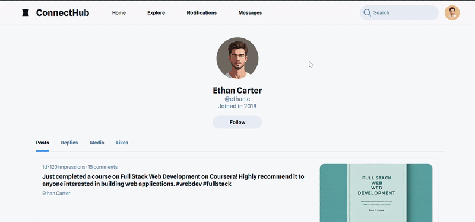

# [GenAI for Front-End Developers](https://www.coursera.org/learn/genai-for-front-end-developers)

This repository contains the lessons I learn through this Coursera course. [Read more details about the course here](https://www.coursera.org/learn/genai-for-front-end-developers).

* Instructors: [Karlis Zars](https://www.coursera.org/instructor/~149442492), [Starweaver Instructor Team](https://www.coursera.org/instructor/~141793623)
* Offered By **Coursera** instrctor network

## [Course Roadmap](./docs/course-roadmap.pdf)

* Introduction to GenAI for Front End Developer
* [GenAI and Front End Developer: Glossary](./Glossary.md)
* [History & Background for GenAI and Front End Developer](./GenAI_history.md)
* [Demo for UI Design with GenAI Tools](./designs/README.md)
* [Demo for Code Generation with GitHub Copilot](./codes/README.md)
* Remediating Risks and Ethical Concerns
* Demo for Building a Responsive Web-Page with ChatGPT-4
* Demo for Automated Testing with GenAI
* Practice Project for Front End Developers
* Assessment for Front End Developers
* Closing Thoughts: What's Next

## Exercices

### Design Challenge

**Scenario**: You are a designing a new music streaming app. The home screen should feature trending songs, personalized playlists, and a search bar.

**Task**:

* [x] Generate an initial home screen design for the music streaming app.
[View the home screen.](./designs/music-streaming-app/README.md#initial-design)
* [x] Create at least 2 variations of the design.
* [x] Tailor one of the designs for a different theme (e.g., podcast-focused).
[View the design iterations for Music Streaming app](./designs/music-streaming-app/README.md)

**Open Ended Questions**:

1. How would you enhance the AI-generated design to align with your unique creative vision?

    **A**: I would give small and simple intructions to GenAI to fix minor things for me. I prefer using Google Stitch and I copy the designs to Figma where I can modify those according to my taste.

2. What additional features might improve the user experience of the music streaming app?

    **A**: AI integrated voice and image searches can enhance user experience by making it easy to find songs by recording background music or scanning album covers or lyrics.

### Coding Challenge

**Scenario**: You are adding a feature to a web app that displays a modal window when a button is clicked. The modal should close when the user clicks outside of it or presses the "Esc" key.

**Task**:

* [x] Generate a function to open and close the modal window.
* [x] Implement the functionality to close the modal when clicking outside of it or pressing the "Esc" key.
* [x] Integrate the generated code into your existing project and test it.

**Open Ended Questions**:

1. How would you enhance the AI-generated code to better fit your project requirements?

    **A**: I would review the code, understand its logic, and write brief meaningful comments around the code snippet.

2. What additional features might improve the user experience of the modal window?

    **A**: Some additional features that could improve the user experience of the modal window include:
    * Allowing the modal to be draggable or resizable.
    * Making the modal accessible by supporting keyboard navigation and screen readers.
    * Providing customizable buttons (e.g., "Cancel", "Confirm") and supporting callback functions.
    * Adding smooth open/close animations for better visual feedback.
    * Preventing background scrolling when the modal is open.
    * Supporting focus trapping to keep keyboard focus within the modal.
    * Offering responsive design so the modal works well on all devices.

### [Responsive Webpage Showcase](./peer-graded-assignment/README.md) (Optional)

* Please [refer to the README.md](./peer-graded-assignment/README.md) file in the `peer-graded-assignment/` directory for detailed instructions on how to complete this assignment.
* Project Demonstration: 
* Check out the [live preview here](https://shaizcodes.github.io/GenAI-for-Front-End-Developers/peer-graded-assignment/project/).
