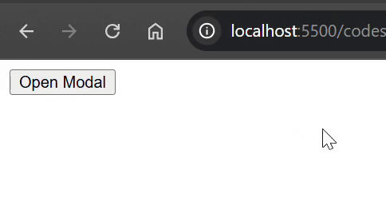

# Code Generation with GitHub Copilot

I have used GitHub Copilot to generate code snippets for a modal window functionalities.

## Features of the modal window include

* Clicking the "Open Modal" button displays the modal.
* Clicking outside the modal closes it.
* Pressing the "Esc" key when the modal is opened closes it.
* The close button inside the top right corner of the modal closes it.

## Code Snippet

### JavaScript

```javascript
// generate a function to open and close the modal window
function openModal(modalId) {
    const modal = document.getElementById(modalId);
    if (modal) {
        modal.classList.remove("modal--hidden");
    } else {
        console.error(`Modal with id ${modalId} not found.`);
    }
}

// implement the functionality to close the modal when clicking outside of it or pressing the "Esc" key.
function closeModal(modalId) {
    const modal = document.getElementById(modalId);
    if (modal) {
        modal.classList.add("modal--hidden");
    } else {
        console.error(`Modal with id ${modalId} not found.`);
    }
}

// Event listener for closing the modal when clicking outside of it
document.addEventListener('click', function(event) {
    const modal = document.querySelector('.modal');
    const modalOpenButton = document.querySelector('.modal__open-button');
    if (event.target === modalOpenButton) {
        openModal(modal.id);
        return; // Do not close if the click is on the button that opens the modal
    }
    !modal.contains(event.target) && closeModal(modal.id);
});

// Event listener for closing the modal when pressing the "Esc" key
window.addEventListener('keydown', function(event) {
    if (event.key === "Escape") {
        const modal = document.querySelector('.modal');
        if (modal) {
            closeModal(modal.id);
        }
    }
});
```

### HTML

```html
<!DOCTYPE html>
<html lang="en">
<head>
    <meta charset="UTF-8">
    <meta name="viewport" content="width=device-width, initial-scale=1.0">
    <title>Document</title>
    <style>
        .modal {
            position: absolute;
            background-color: rgba(255, 255, 255, 1);
            border: 1px solid black;
            display: flex;
            justify-content: flex-end;
        }
        .modal__content {
            border: 1px solid black;
            display: flex;
            gap: 0;
            flex-direction: column;
        }
        .modal__close-button {
            border: 1px solid black;
            background-color: rgb(255, 0, 0);
            color: rgb(255, 255, 255);
            align-self: flex-end;
        }
        .modal__text {
            padding-inline: 1em;
        }
        .modal--hidden {
            display: none;
        }
    </style>
</head>
<body>
    <div id="myModal" class="modal modal--hidden">
        <div class="modal__content">
            <button class="modal__close-button" onclick="closeModal('myModal')" aria-label="close modal">&times;</button>
            <p class="modal__text">It is a modal. Try closing it...</p>
        </div>
    </div>

    <button class="modal__open-button" onclick="openModal('myModal')">Open Modal</button>

    <script src="modal.js"></script>
</body>
</html>
```

### Sample Output


