# UI Designs with GenAI Tools

It contains a list of UI designs produced by prompts to a Generative AI tool.

* [*View the UI designs on Figma*](https://www.figma.com/design/meMMZoNFw2ycGmFILwug3T/Google-Stitch-Designs?node-id=0-1&p=f&t=O1VSQYcHoYo2yvhN-0)
* Or [*View Google Stitch chat*](https://stitch.withgoogle.com/projects/17161384992744200327) that generated the UI designs
* Or [*View ChatGPT chat*](https://chatgpt.com/share/6839a17e-58cc-8006-b257-6e5870f0c3e2) for some UI designs

## Generative AI Tools

* Try [*Google Stitch*](https://stitch.withgoogle.com)
* Try [*ChatGPT*](https://chatgpt.com)

## UI Designs

### Mobile Banking App

1. **Prompt**:

    > Generate a home screen design for a mobile banking app. The design should include a balance overview, recent transactions, and navigation to different banking features.

    **Response**:

    > | Google Stich | ChatGPT |
    > | :----------: | :-----: |
    > | 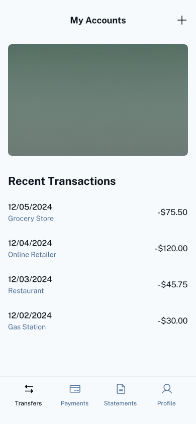 | 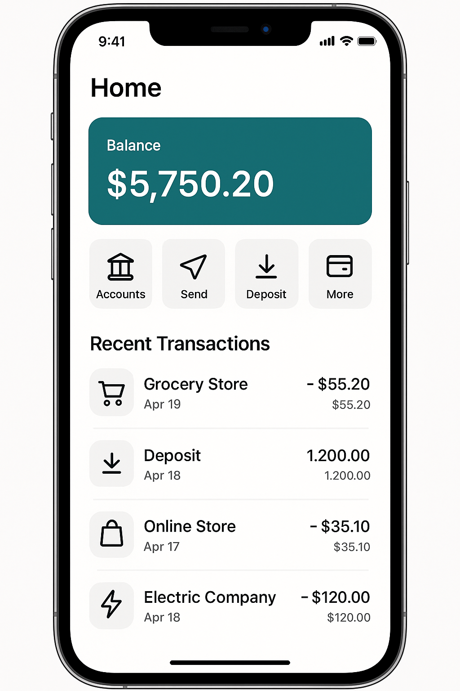 |

2. **Prompt**:

    > Modify the home screen design to include a dark mode option and a quick settings menu for easy accessibility.

    **Response**:

    > | Google Stich | ChatGPT |
    > | :----------: | :-----: |
    > | 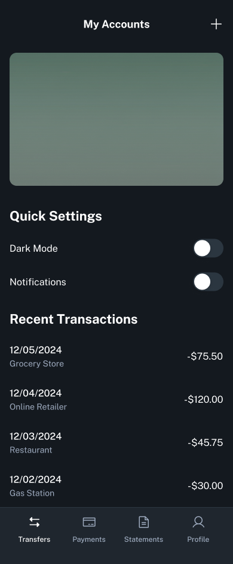 | 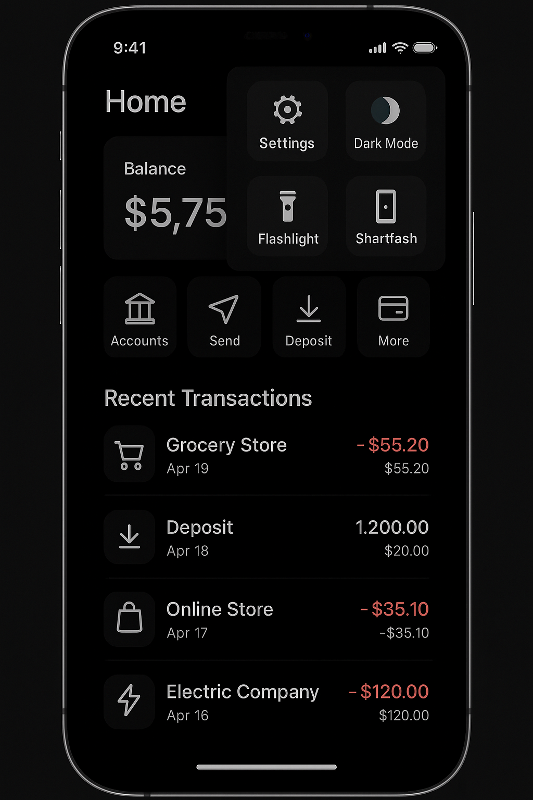 |

3. **Prompt**:

    > Update the home screen design to show promotional offers and include a section for user notifications.

    **Response**:

    > | Google Stich | ChatGPT |
    > | :----------: | :-----: |
    > | 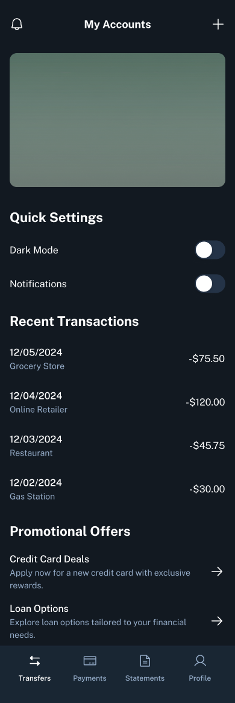 | 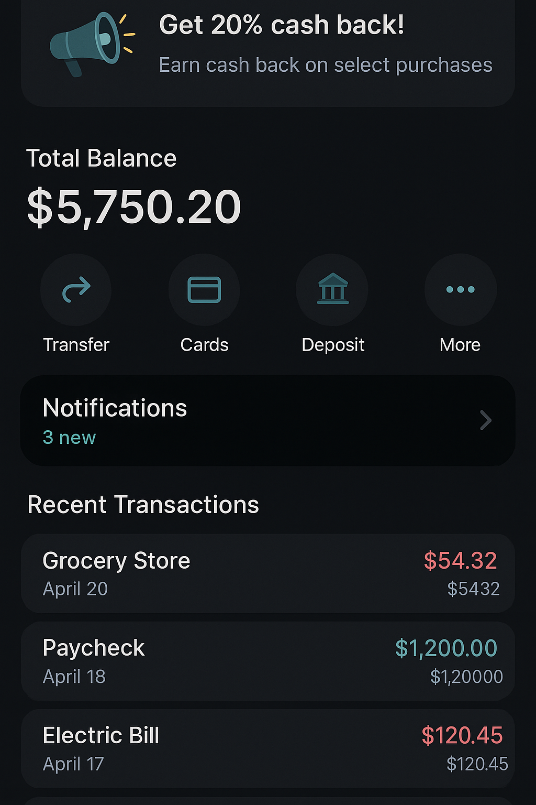 |

4. **Prompt**:

    > Generate a home screen design for a fitness tracking app. Include sections for daily steps, workout summary, and health tips.

    **Response**:

    > | Google Stich | ChatGPT |
    > | :----------: | :-----: |
    > | 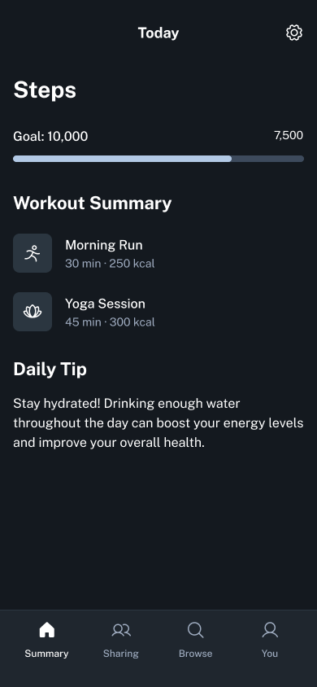 | 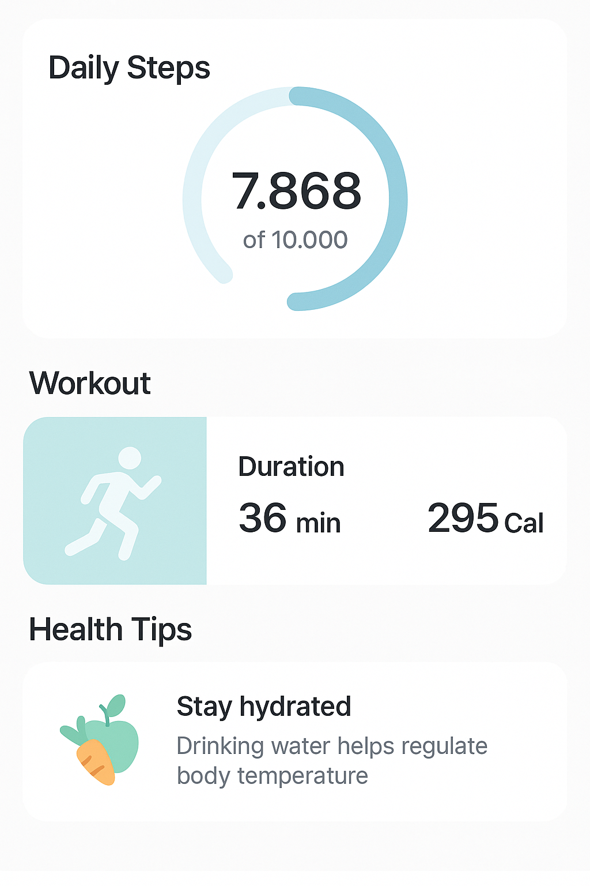 |
    >
    > [!NOTE]
    > ChatGPT ignored the previous context, whereas, Stitch considered it for the new design.

    The same above prompt in a separate Google Stitch chat produced the following design due to the free context there rather than the restrictive one in current chat.

    > 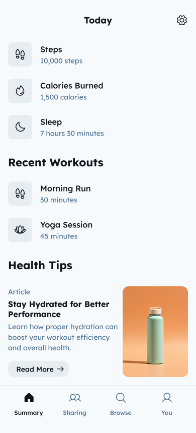

5. **Prompt**:

    > Create a home screen design for an e-commerce app. Include sections for featured products, categories, and user profile.

    **Response**:

    > | Google Stich | ChatGPT |
    > | :----------: | :-----: |
    > | 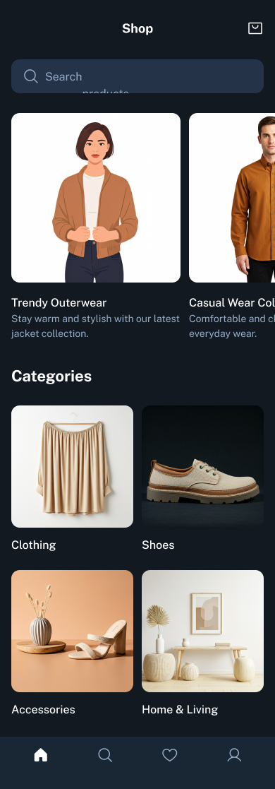 | 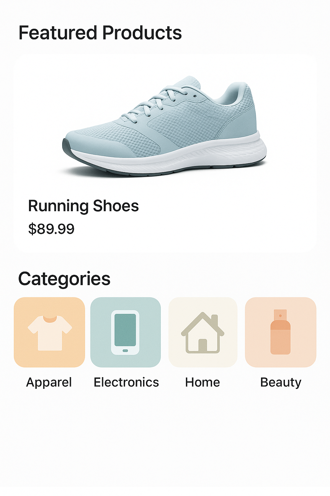 |

    And the same prompt in a separate Google Stitch chat produced the following design.

    > | 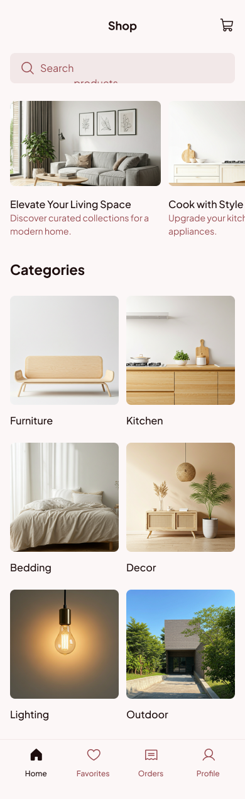
