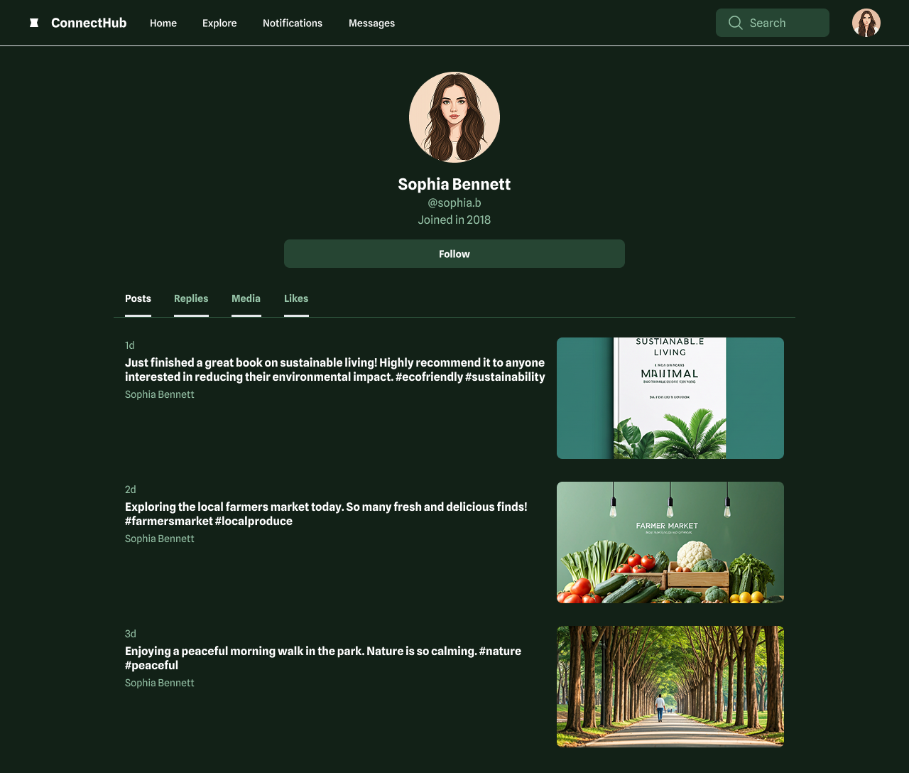
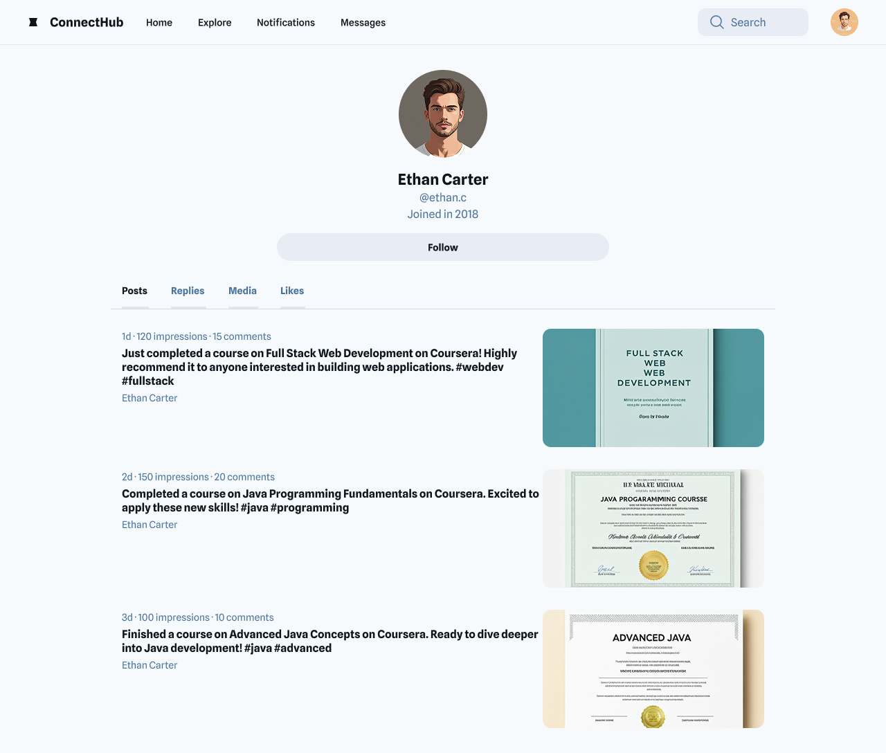

# Practice Peer-graded Assignment: Responsive Webpage Showcase

This is a practice peer-graded assignment to create a responsive webpage using GenAI tools. [Check out the live preview here](https://shaizcodes.github.io/GenAI-for-Front-End-Developers/peer-graded-assignment/project/).

## Step-By-Step Assignment Instructions

- [x] **Select your favorite GenAI Tool**.

  - I prefer using [Google Stitch](https://stitch.withgoogle.com/) for generating UI designs and code snippets.

- [x] **Generate a UI Design**: Use GenAI tool to generate a UI design for a "User Profile" page in a web application. The design should include sections for user information, profile picture, recent activities, and settings. You can start with a sketch, like we did in the demonstration, if you like.

  - **Initial Design**: 

- [x] **Refine and Iterate**: Collaborate with the GenAI tool to refine and iterate on the UI design.

  - **Refined Design**: 

- [x] **Translate Design into Code**: Use GenAI to convert the final UI design into HTML and CSS. Ensure the layout is responsive and visually appealing.

  - I generated most of the stuff from scratch to boost my confidence in CSS and HTML. You can [open index.html](./project/index.html) and [view styles.css](./project/style.css) in the project directory.

- [ ] **Submit 2 screenshots of your final UI**: Use the 2 screenshots to demonstrate the interactivity or responsiveness of your webpage.

## Optional Steps

- [ ] **Add Interactivity**: Create JavaScript code to add interactivity to the user profile page, such as editing user information and updating the profile picture.

- [ ] **Generate an Additional UI Component**: Ask the GenAI tool to generate another UI component for a different page in the application, such as a "Dashboard" or "Settings" page. Integrate this new component into your project.

- [ ] **Test the Implementation**: Test the entire implementation across different browsers and devices to ensure compatibility and responsiveness.
